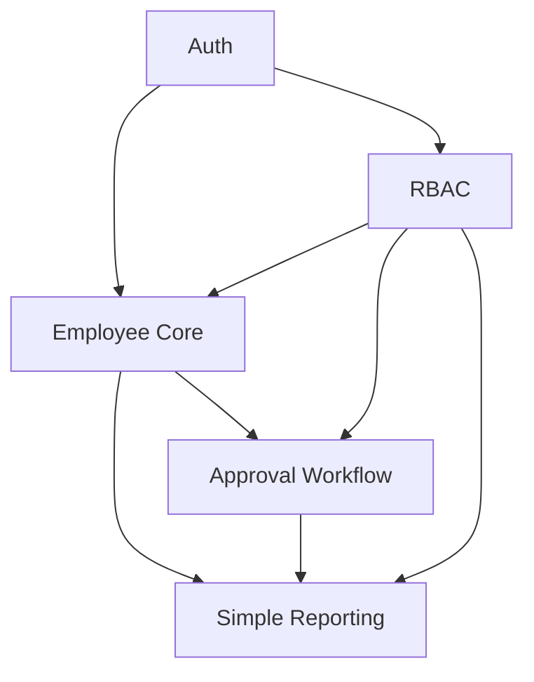

# HRIS P1 — Product Requirements Document

## Document Purpose

This document defines the product breakdown for the **HRIS P1 Prototype**, aligned with the official HRIS specification. It synthesizes architecture requirements from `WORKFLOW.md`, `DATABASE.md`, `RBAC.md`, and `API.md`.

**P1 prototype goal:** Demonstrate specification-aligned HR operations—authentication, RBAC, employee and family management, full personal profile modules, gated approval workflow, and operational reporting—on an enterprise-ready foundation (Next.js, NestJS, Prisma, PostgreSQL).

For a concise list of what is implemented today, see **[P1-SCOPE.md](./P1-SCOPE.md)**.

> **Note:** Earlier sections labeled “P0” describe the original phased delivery plan. The runnable prototype branding is **HRIS P1** and includes family, profile modules, and domain-based approvals beyond the initial P0 slice.

---

## Explicitly Out of Scope (P0)

The following are **not** included in P0 and must not drive design or delivery decisions for this release:

| Excluded capability | Rationale |
|---------------------|-----------|
| Payroll | Requires compensation rules, tax, and pay-run complexity beyond P0 |
| Marriage merge | Specialized employee record merge; deferred to later HR data governance phase |
| AI reporting | Analytics/insights layer; P0 uses simple operational reporting only |
| Financial integration | ERP/accounting connectors; no external finance systems in P0 |

---

## 1. Core Modules (P0)

Five modules form the P0 product surface. Each maps to API endpoint groups, data domains, and frontend feature areas.

### 1.1 Auth

**Purpose:** Secure access, session identity, and permission claims for all other modules.

| Capability | P0 scope |
|------------|----------|
| User authentication | Email/password or SSO-ready login (JWT issuance) |
| Session / token context | Access token with embedded role and permission claims |
| Identity linkage | `users` record linked to `employees` where applicable |
| Logout / token refresh | Baseline session lifecycle |
| Password reset (admin-assisted) | Optional P0; email self-service may defer |

**Dependencies:** None (foundation module).  
**Consumers:** All modules.

---

### 1.2 Employee Core

**Purpose:** System of record for people and organizational placement.

| Capability | P0 scope |
|------------|----------|
| Employee profile | Create, read, update baseline fields (name, employee ID, contact, status, hire date) |
| Employment status | Active, inactive, terminated (enum baseline) |
| Organization reference | Department assignment; department master list (read) |
| Manager relationship | `reports_to` for approval routing |
| Search & list | Paginated employee directory with filters (department, status) |
| Audit on profile changes | Who changed what and when (event or audit row) |

**Data entities (logical):** `employees`, `departments`, linkage to `users`.

**Dependencies:** Auth (authenticated access), RBAC (who can read/update).

---

### 1.3 RBAC

**Purpose:** Enforce least-privilege access across API and UI.

| Capability | P0 scope |
|------------|----------|
| Role catalog | `SUPER_ADMIN`, `HR_ADMIN`, `MANAGER`, `EMPLOYEE` |
| Permission catalog | `resource:action` pattern (e.g. `employee:read`, `approval:approve`) |
| Role–permission mapping | Admin-assignable matrix (seed + admin UI or API) |
| User–role assignment | One or more roles per user |
| API enforcement | NestJS guards on every protected route |
| UI enforcement | Hide/disable actions based on claims |
| Privileged action audit | Log role/permission changes and sensitive reads where required |

**Dependencies:** Auth (identity), Employee Core (manager/employee context for scoped access).

---

### 1.4 Approval Workflow

**Purpose:** Standardized request → review → decision flow for HR actions in P0.

| Capability | P0 scope |
|------------|----------|
| Request types (P0) | At minimum: **profile change request** and **generic HR request** (single template) |
| Lifecycle states | `DRAFT` → `SUBMITTED` → `IN_REVIEW` → `APPROVED` \| `REJECTED`; `CANCELLED` by submitter |
| Routing | Employee submits → direct manager receives task → approve/reject |
| Task inbox | Manager queue; submitter status view |
| Immutable event log | All transitions stored in `approval_events` |
| Post-approval effect | Approved profile changes applied to employee record (HR Admin or system rule) |

**Data entities (logical):** `approval_requests`, `approval_steps`, `approval_events`; optional workflow template metadata.

**Dependencies:** Auth, Employee Core (submitter, manager), RBAC (`approval:*` permissions).

---

### 1.5 Simple Reporting

**Purpose:** Operational visibility for HR and managers without analytics/AI complexity.

| Capability | P0 scope |
|------------|----------|
| Headcount by department | Count active employees grouped by department |
| Headcount by status | Active / inactive / terminated breakdown |
| Approval pipeline summary | Count by state (submitted, in review, approved, rejected) for a date range |
| Pending approvals (manager) | List or count for current manager |
| Export | CSV export for headcount and approval summary (P0 nice-to-have; table view required) |

**Dependencies:** Employee Core, Approval Workflow, RBAC (report permissions, e.g. `report:read` scoped by role).

**Explicitly not in P0:** AI-generated insights, predictive analytics, financial dashboards, payroll reports.

---

## 2. Feature Priorities

Priorities use **P0-Must**, **P0-Should**, **P0-Could** for the prototype release.

### P0-Must (release blockers)

| # | Module | Feature |
|---|--------|---------|
| M1 | Auth | Login, JWT, authenticated API access |
| M2 | Auth | Current user context (`/me`) with roles and permissions |
| M3 | RBAC | Seed roles and permissions; guard enforcement on API |
| M4 | Employee Core | Employee CRUD (baseline fields); department reference |
| M5 | Employee Core | Manager (`reports_to`) on employee record |
| M6 | Approval Workflow | Submit request, manager approve/reject, state machine |
| M7 | Approval Workflow | Audit event log for all transitions |
| M8 | RBAC | Permission checks on employee and approval endpoints |
| M9 | Simple Reporting | Headcount by department (HR Admin) |
| M10 | Simple Reporting | Manager pending approvals view |

### P0-Should (high value, complete soon after Must)

| # | Module | Feature |
|---|--------|---------|
| S1 | Employee Core | Paginated search and filters |
| S2 | Approval Workflow | Draft save and cancel |
| S3 | Approval Workflow | Apply approved changes to employee profile |
| S4 | RBAC | Admin API/UI for user–role assignment |
| S5 | Simple Reporting | Approval pipeline summary by status |
| S6 | Employee Core | Profile change audit trail |

### P0-Could (if capacity allows)

| # | Module | Feature |
|---|--------|---------|
| C1 | Auth | Refresh token rotation |
| C2 | Simple Reporting | CSV export |
| C3 | Approval Workflow | Second request type template |
| C4 | Employee Core | Soft delete for employees |

---

## 3. User Roles

P0 defines four primary roles. Permissions are additive via role–permission mapping; a user may hold multiple roles (e.g. Manager + Employee).

| Role | Primary persona | P0 responsibilities |
|------|-------------------|---------------------|
| **SUPER_ADMIN** | IT / platform owner | Full system access; bootstrap RBAC; manage all users and roles |
| **HR_ADMIN** | HR operations | Employee master data CRUD; org/department maintenance; view all approvals and reports; may act on approved requests |
| **MANAGER** | Line manager | View direct/indirect reports (policy: direct reports in P0); approval inbox; limited employee read; team-oriented reports |
| **EMPLOYEE** | Individual contributor | View own profile; submit approval requests; track own request status |

### Role × module matrix (summary)

| Module | SUPER_ADMIN | HR_ADMIN | MANAGER | EMPLOYEE |
|--------|:-----------:|:--------:|:-------:|:--------:|
| Auth (login) | ✓ | ✓ | ✓ | ✓ |
| Employee Core (all employees) | ✓ | ✓ | — | — |
| Employee Core (own / team) | ✓ | ✓ | team read | own read |
| RBAC administration | ✓ | limited* | — | — |
| Approval (submit) | ✓ | ✓ | ✓ | ✓ |
| Approval (review) | ✓ | ✓ | ✓ (assigned) | — |
| Simple Reporting (org-wide) | ✓ | ✓ | — | — |
| Simple Reporting (team/pending) | ✓ | ✓ | ✓ | own requests |

\* *HR Admin may assign roles except SUPER_ADMIN in P0, or per policy defined at implementation.*

### Representative permissions (from RBAC architecture)

- `employee:read`, `employee:update`, `employee:create`
- `approval:submit`, `approval:review`, `approval:approve`, `approval:reject`
- `report:read`, `rbac:manage` (admin roles)

---

## 4. Workflow Dependencies

Understanding cross-module dependencies prevents incorrect build order and integration gaps.

### 4.1 Dependency graph (logical)

### 4.2 Approval workflow — P0 routing rules

1. **Employee** creates request (optionally `DRAFT` → `SUBMITTED`).
2. System resolves **approver** from `employees.reports_to` (direct manager).
3. Request enters `IN_REVIEW`; manager receives task in inbox.
4. **Manager** approves or rejects; system writes `approval_events`.
5. On **APPROVED**: HR Admin or automated job applies change to Employee Core (P0-Should).
6. On **REJECTED**: submitter notified via UI status; no employee record change.

### 4.3 Module coupling table

| From | To | Dependency type |
|------|-----|-----------------|
| Approval Workflow | Employee Core | Submitter ID, manager ID, department context |
| Approval Workflow | RBAC | `approval:*` permissions per action |
| Approval Workflow | Auth | Authenticated actor on every transition |
| Simple Reporting | Employee Core | Headcount and status aggregates |
| Simple Reporting | Approval Workflow | Pipeline counts and pending tasks |
| RBAC | Auth | User identity for role assignment |
| Employee Core | RBAC | Field-level and record-level access rules |

### 4.4 Data prerequisites (from database architecture)

Before approval or reporting functions correctly:

- `users` ↔ `employees` linkage established
- `departments` seeded
- `reports_to` populated for employees who can submit requests
- Roles and permissions seeded (`roles`, `permissions`, `role_permissions`, `user_roles`)

---

## 5. Technical Risks

| ID | Risk | Impact | Mitigation (P0) |
|----|------|--------|-----------------|
| R1 | RBAC drift between API and UI | Users see actions that fail on submit, or miss allowed actions | Single permission claim source in JWT; shared permission constants package or generated OpenAPI client |
| R2 | Manager resolution failures | Requests stuck with no approver | Validate `reports_to` on submit; block submit with clear error; HR Admin override path (P0-Should) |
| R3 | Workflow state inconsistency | Double approval, lost transitions | Optimistic locking or status check on update; append-only `approval_events` |
| R4 | Scope creep into payroll/finance | Delayed P0, wrong data model | Enforce out-of-scope list in PRD and API reviews |
| R5 | Over-engineered workflow engine | Building generic BPMN before P0 needs | Fixed P0 template: employee → manager → terminal; defer parallel chains and delegation |
| R6 | Reporting performance on large datasets | Slow dashboards | Indexed filters (department_id, status); paginated aggregates; no heavy joins in P0 |
| R7 | Prisma schema churn | Migration pain across team | Name migrations by capability; keep P0 schema in one bounded context per module |
| R8 | JWT and permission payload size | Token bloat, cache issues | Minimal claims in token; expand permissions via `/me` or server-side cache |
| R9 | Audit completeness | Compliance gaps later | Log approval transitions and privileged RBAC/employee mutations from day one |
| R10 | Monorepo contract mismatch | Frontend/backend integration breaks | Versioned `/api/v1`; DTO validation; contract tests on critical flows |

---

## 6. Recommended Development Order

Build in layers so each sprint delivers testable vertical slices. Order aligns with dependency graph and de-risks Auth + RBAC early.

### Phase 0 — Foundation (Week 1)

| Order | Deliverable | Modules |
|-------|-------------|---------|
| 0.1 | PostgreSQL + Prisma schema: `users`, `employees`, `departments` | Employee Core (data) |
| 0.2 | NestJS project structure, health check, `/api/v1` | Platform |
| 0.3 | Docker Compose for local Postgres | Platform |

### Phase 1 — Identity & access (Week 1–2)

| Order | Deliverable | Modules |
|-------|-------------|---------|
| 1.1 | Auth: login, JWT, `/me` | Auth |
| 1.2 | RBAC seed data + guards on sample routes | RBAC |
| 1.3 | Next.js auth shell, protected routes, permission-aware nav | Auth, RBAC |

### Phase 2 — Employee master (Week 2–3)

| Order | Deliverable | Modules |
|-------|-------------|---------|
| 2.1 | Employee CRUD API + department list | Employee Core |
| 2.2 | Employee directory UI (HR Admin) | Employee Core |
| 2.3 | Employee self-service profile view | Employee Core, RBAC |
| 2.4 | `reports_to` and manager assignment | Employee Core |

### Phase 3 — Approvals (Week 3–4)

| Order | Deliverable | Modules |
|-------|-------------|---------|
| 3.1 | Prisma: `approval_requests`, `approval_steps`, `approval_events` | Approval Workflow |
| 3.2 | Submit + manager approve/reject API | Approval Workflow |
| 3.3 | Submitter and manager UIs (inbox, detail, actions) | Approval Workflow |
| 3.4 | Event log visibility on request detail | Approval Workflow |
| 3.5 | Apply approved changes to employee (P0-Should) | Approval Workflow → Employee Core |

### Phase 4 — Reporting & hardening (Week 4–5)

| Order | Deliverable | Modules |
|-------|-------------|---------|
| 4.1 | Headcount by department/status API | Simple Reporting |
| 4.2 | Approval pipeline summary API | Simple Reporting |
| 4.3 | HR dashboard and manager pending view | Simple Reporting |
| 4.4 | RBAC admin for user–roles (P0-Should) | RBAC |
| 4.5 | End-to-end smoke: login → submit → approve → report | All |

### Phase 5 — P0 release criteria

- All **P0-Must** features complete and demonstrable
- Out-of-scope items verified absent from build
- Critical path documented: Auth → RBAC → Employee → Approval → Reporting
- Architecture docs (`API.md`, `DATABASE.md`, `RBAC.md`, `WORKFLOW.md`) remain aligned with implemented behavior

---

## P0 Success Criteria

| Criterion | Measurement |
|-----------|-------------|
| Independent FE/BE development | Stable `/api/v1` contracts; no breaking changes without version bump |
| RBAC enforced | Unauthorized API calls return 403; UI matches permissions |
| Approval lifecycle proven | At least one request type completes full state machine with audit log |
| Employee master usable | HR Admin can maintain employees; manager relationship drives routing |
| Operational reporting | HR sees headcount; manager sees pending approvals |
| Enterprise readiness | Auditable events, PostgreSQL + Prisma migrations, containerized local stack |

---

## Appendix — Traceability to architecture docs

| PRD section | Source documents |
|-------------|------------------|
| Core modules | `API.md` endpoint groups, `DATABASE.md` domains |
| RBAC & roles | `RBAC.md` |
| Approval workflow | `WORKFLOW.md` |
| Technical stack | `README.md` |
| Out of scope | Product directive (this PRD) |

---

*Version: P1.0 — HRIS P1 Prototype aligned with the official HRIS specification.*
