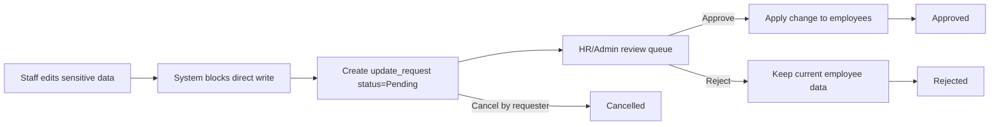

# Approval Workflow Design - HRIS P1 Prototype

## Scope and Intent

This workflow design enforces controlled updates to gated profile and family domains in the HRIS P1 Prototype.

Key rules:

- Staff cannot directly modify sensitive fields in `employees`.
- Sensitive changes must be submitted as `update_requests`.
- HR/Admin reviews each request and decides `Approved` or `Rejected`.

Workflow statuses:

- `Pending`
- `Approved`
- `Rejected`
- `Cancelled`

---

## 1) Workflow Diagram Explanation

### Business flow (high-level)

### Explanation

1. Staff submits a change request for sensitive profile fields.
2. System stores requested values in `update_requests.payload_after`; no immediate update to `employees`.
3. Request enters `Pending` and is visible in HR/Admin approval queue.
4. Approver takes action:
   - `Approve`: system updates `employees` and marks request `Approved`.
   - `Reject`: system preserves current employee record and marks request `Rejected`.
5. Requester can cancel while still `Pending`, moving request to `Cancelled`.

This ensures sensitive data changes are always gated by approval and fully auditable.

---

## 2) State Transitions

### Allowed transitions

| From | To | Actor | Rule |
|---|---|---|---|
| `Pending` | `Approved` | HR/Admin | Valid review decision; apply changes atomically |
| `Pending` | `Rejected` | HR/Admin | Valid review decision; no employee data mutation |
| `Pending` | `Cancelled` | Requester (Staff/HR/Admin requester) | Allowed before decision is made |

### Terminal states

- `Approved`, `Rejected`, and `Cancelled` are terminal in P0.
- No reopen/resubmit transition in P0 (requester creates a new request instead).

### Invalid transitions (must be blocked)

- `Approved -> Rejected`, `Rejected -> Approved`, `Cancelled -> Pending`
- Any action on terminal status
- Staff attempting `Pending -> Approved/Rejected`

### State machine constraints

- Only one final decision per request.
- Transition must pass role authorization and data-scope checks.
- Transition operation must write both status change and audit record in one transaction.

---

## 3) API Flow

### Main endpoints (P1)

1. `POST /api/v1/update-requests`
   - Actor: Staff/HR/Admin
   - Behavior: creates request with `status = Pending`
   - Validation: sensitive field whitelist, requester identity, city scope

2. `GET /api/v1/update-requests`
   - Staff: own requests only
   - HR: requests in own city
   - Admin: all requests

3. `GET /api/v1/update-requests/{id}`
   - Scope-enforced detail endpoint

4. `POST /api/v1/update-requests/{id}/approve`
   - Actor: HR/Admin only
   - Behavior: apply payload to `employees`, set `Approved`, write audit log

5. `POST /api/v1/update-requests/{id}/reject`
   - Actor: HR/Admin only
   - Behavior: set `Rejected`, store reason/comment, write audit log

6. `POST /api/v1/update-requests/{id}/cancel`
   - Actor: requester only (or Admin override policy if enabled)
   - Behavior: set `Cancelled`, write audit log

### Authorization checkpoints per endpoint

- Permission check: `approval_center:view`, `approval_center:approve` as needed
- Scope check:
  - Staff: own request (`requester_employee_id == current_employee_id`)
  - HR: request city in assigned city scope
  - Admin: unrestricted

### Response conventions

- `401` unauthenticated
- `403` role/scope violation
- `409` invalid state transition (e.g., approving already rejected request)
- `200/201` successful state change or creation

---

## 4) Database Interaction Flow

### Request creation (`Pending`)

1. Read current employee snapshot for target fields.
2. Insert row in `update_requests`:
   - `status = Pending`
   - `payload_before` = current values
   - `payload_after` = requested new values
   - `requester_employee_id`, `target_employee_id`, `city_id`
3. Insert `approval_logs` event with action `SUBMIT`.

### Approve flow (`Pending -> Approved`)

Execute in one DB transaction:

1. `SELECT ... FOR UPDATE` on `update_requests` to lock row.
2. Validate status still `Pending`.
3. Update `employees` with approved fields from `payload_after`.
4. Update `update_requests.status = Approved`, set `resolved_at`.
5. Insert `approval_logs` action `APPROVE` with from/to status.
6. Commit transaction.

### Reject flow (`Pending -> Rejected`)

Execute in one DB transaction:

1. Lock request row.
2. Validate status `Pending`.
3. Update request status to `Rejected`, set `resolved_at`.
4. Insert `approval_logs` action `REJECT` with reason.
5. Commit transaction.

### Cancel flow (`Pending -> Cancelled`)

Execute in one DB transaction:

1. Lock request row.
2. Validate requester ownership and status `Pending`.
3. Update request status to `Cancelled`, set `resolved_at`.
4. Insert `approval_logs` action `CANCEL`.
5. Commit transaction.

### Data integrity controls

- Foreign keys on requester/target employees and actor user.
- Indexed columns: `status`, `city_id`, `requester_employee_id`, `assigned_approver_user_id`.
- Optimistic or row-lock strategy to prevent double decision.

---

## 5) Audit Logging Strategy

### Audit objectives

- Reconstruct every request lifecycle end-to-end.
- Identify actor, action, timestamp, and status transition.
- Support compliance review and incident investigation.

### What to log (mandatory)

For every workflow action (`SUBMIT`, `APPROVE`, `REJECT`, `CANCEL`, optional `COMMENT`):

- `update_request_id`
- `actor_user_id`
- `action`
- `from_status`
- `to_status`
- `comment` (required on rejection)
- `metadata` (ip, user agent, correlation id if available)
- `created_at`

### Logging patterns

- Append-only `approval_logs` (no update/delete in normal operations).
- Write log in same DB transaction as state change.
- Log denied approval attempts as security events (separate app/security log stream).

### Retention and access

- Retain workflow audit logs for minimum compliance window (policy-defined).
- Read access:
  - Staff: own request logs
  - HR: logs for city-scoped requests
  - Admin: all logs

---

## P1 Guardrails

- Sensitive employee fields are write-protected on direct employee update APIs for Staff role.
- All sensitive mutations must pass through `update_requests`.
- Approval decision is limited to HR/Admin.
- Terminal statuses are immutable.
